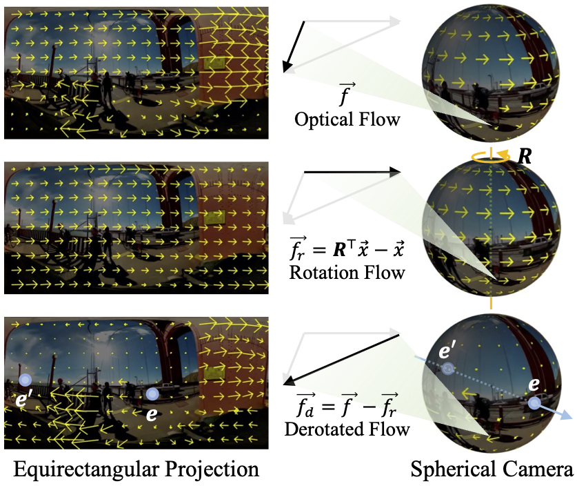

# 🍳 PanFlow

### PanFlow: Decoupled Motion Control for Panoramic Video Generation
Cheng Zhang, Hanwen Liang, Donny Y. Chen, Qianyi Wu, Konstantinos N. Plataniotis, Camilo Cruz Gambardella, Jianfei Cai

### [Paper](https://arxiv.org/abs/2512.00832) | [Video](https://www.youtube.com/watch?v=sFTWwlHjNtg) | [Data](https://huggingface.co/datasets/chengzhag/PanFlow)

## 🚀 TLDR

PanFlow is a framework for controllable 360° panoramic video generation that decouples motion input into two interpretable components: rotation flow and derotated flow.



By conditioning diffusion on spherical-warped motion noise, PanFlow enables precise motion control, produces loop-consistent panoramas, and supports applications such as motion transfer:


and panoramic video editing:


## 🛠️ Installation

We use conda to manage the environment. You can create the environment by running the following command:

```bash
conda create -n panflow python=3.11 -y
conda activate panflow
pip install torch==2.5.1 torchvision==0.20.1 --index-url https://download.pytorch.org/whl/cu121
pip install -r requirements.txt
```

We use wandb to log and visualize the training process. You can create an account then login to wandb by running the following command:

```bash
wandb login
```

## ⚡ Quick Demo in Figure 6

### Checkpoints

Download the pretrained checkpoints from this [OneDrive link](https://monashuni-my.sharepoint.com/:f:/g/personal/cheng_zhang_monash_edu/IgB2ZqOY57SXS7PkWRWRL5zRAX1hUtPjg260Q0XFi2XSGdw?e=KDAJyZ) to `checkpoints/` folder, or from their corresponding source:
- Download the [pretrained model](https://huggingface.co/Eyeline-Research/Go-with-the-Flow/resolve/main/I2V5B_final_i38800_nearest_lora_weights.safetensors) to `checkpoints/`.
- Download the pretrained model `PanoFlow(RAFT)-wo-CFE.pth` of Panoflow at [weiyun](https://share.weiyun.com/SIpeQTNE), then put it in `checkpoints/` folder. This is used for optical flow estimation in noise warping.
- Download the pretrained model `i3d_pretrained_400.pt` in [common_metrics_on_video_quality](https://github.com/JunyaoHu/common_metrics_on_video_quality/blob/main/fvd/videogpt/i3d_pretrained_400.pt), then put it in `checkpoints/` folder. This is used for FVD calculation during evaluation.

Download our finetuned LoRA weights from [here](https://monashuni-my.sharepoint.com/:f:/g/personal/cheng_zhang_monash_edu/IgD3n8nXvgt7RLGoMhPKIx5CAeDA24Anoe7rsuzwF5cFKEk?e=Nvn2m5) and put it in `logs/` folder.

### Toy Dataset

Download the toy dataset from [OneDrive](https://monashuni-my.sharepoint.com/:f:/g/personal/cheng_zhang_monash_edu/IgD_BVrZKrXfTY8lJ_FliYjxAavs5jTJycK1p7RVNEkDjLE?e=ZMzQCV) or [Hugging Face](https://huggingface.co/datasets/chengzhag/PanFlow-demo) and put it in `data/360-1M/` folder. The demo videos are from [360-1M](https://github.com/MattWallingford/360-1M), sourced from YouTube, licensed under CC BY 4.0.

### Motion Transfer Demo

Run the following command to generate motion transfer results:

```bash
WANDB_RUN_ID=u95jgv9e python -m demo.demo --demo-name motion_transfer --noise_alpha 0.5
```

### Editing Demo

Run the following command to generate editing results:

```bash
WANDB_RUN_ID=u95jgv9e python -m demo.demo --demo-name editing --noise_alpha 0.5
```

## 📂 Full Dataset

Download the camera pose annotations for 300k clips from [here](https://monashuni-my.sharepoint.com/:u:/g/personal/cheng_zhang_monash_edu/IQBi6d8K7FUbQah5iEnZEZVcAX211fltE7Mq9LPiwMmb3F0?e=aXHFeZ) and unpack it into `data/360-1M/slam_pose/`.

We then generate latent and noise cache for the filtered subset to speed up training. Please download it from [huggingface](https://huggingface.co/datasets/chengzhag/PanFlow) to `data/360-1M/cache/` by:

```bash
huggingface-cli download chengzhag/PanFlow --repo-type dataset --local-dir data/PanFlow
```

<details>
<summary>Alternatively, you can also download the 360-1M videos we filtered to generate your own cache.</summary>

```bash
python -m tools.download_360_1m
```

This script is adapted from [360-1M](https://github.com/MattWallingford/360-1M). Due to the consistent changes in yt-dlp's downloading mechanism to comply with YouTube's anti-scraping mechanism, the script may require some adjustments from time to time.

</details>
<br>

If you want to go through the data curation process by yourself, please follow the steps in [`/curation`](/curation). This will end up with 24k [metadata](https://monashuni-my.sharepoint.com/:u:/g/personal/cheng_zhang_monash_edu/IQD4cMOEcAcMQbuY5NEmhfn2AerzskjXrl75VB35o8_nerI?e=G2345Y) for 400k clips.

## 🎯 Training and Evaluation

Run the following command to start training:

```bash
bash finetune/train_ddp_i2v.sh
```

We used 8 A100 GPUs for training. You'll get a WANDB_RUN_ID (e.g., `u95jgv9e`) after starting the training. The logs will be synced to your wandb account and the checkpoints will be saved in `logs/<WANDB_RUN_ID>/checkpoints/`.

Run the following command to evaluate the model:

```bash
WANDB_RUN_ID=<u95jgv9e_or_your_id_here> python -m finetune.evaluate --num-test-samples 100
```

This evaluation script computes metrics except Q-Align scores. The results will be logged to `logs/<WANDB_RUN_ID>/checkpoints/360-1M/`.

## 📖 Citation

If you find our work helpful, please consider citing:

```bibtex
@inproceedings{zhang2025panflow,
  title={PanFlow: Decoupled Motion Control for Panoramic Video Generation},
  author={Zhang, Cheng and Liang, Hanwen and Chen, Donny Y and Wu, Qianyi and Plataniotis, Konstantinos N and Gambardella, Camilo Cruz and Cai, Jianfei},
  booktitle={Proceedings of the AAAI Conference on Artificial Intelligence},
  year={2026}
}
```

## 💡 Acknowledgements

Our paper cannot be completed without the amazing open-source projects [CogVideo](https://github.com/zai-org/CogVideo), [Go-with-the-Flow](https://github.com/Eyeline-Labs/Go-with-the-Flow), [stella_vslam](https://github.com/stella-cv/stella_vslam), [PySceneDetect](https://github.com/Breakthrough/PySceneDetect)...

Also check out our Pan-Series works [PanFusion](https://github.com/chengzhag/PanFusion) and [PanSplat](https://github.com/chengzhag/PanSplat) towards 3D scene generation with panoramic images!
